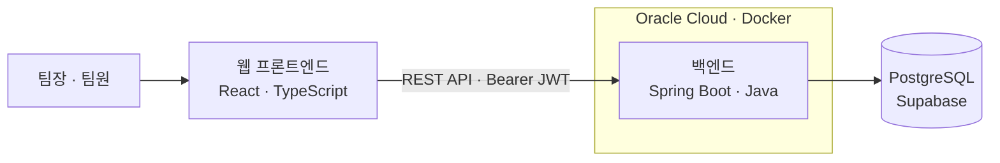

# Risense — 팀플 리스크 레이더

**짧은 정기 체크인으로 팀 프로젝트의 진행 상황과 어려움을 공유하는 협업 지원 서비스**

Risense는 대학 팀 프로젝트에서 작업 배정, 진행 상황, 이슈와 산출물을 한곳에 모으는 졸업 프로젝트다.
팀원은 자신이 맡은 작업의 상황을 정기적으로 보고하고, 팀장은 팀 전체의 진행 상황과 도움이 필요한 작업을 확인한다.
쌓인 체크인 기록을 바탕으로 프로젝트의 위험 신호를 쉽게 파악할 수 있도록 하는 것이 목표다.

## 프로젝트 배경

팀 프로젝트에서는 작업을 나누어도 각자의 실제 진행 상황을 파악하기 어렵다.
문제나 지연 사실이 대화방에 흩어지거나 마감 직전에 공유되면, 팀이 대응할 시간도 줄어든다.

Risense는 다음 질문에 답할 수 있는 공통 기록을 만들고자 한다.

- 누가 어떤 작업을 맡고 있으며, 얼마나 진행됐는가?
- 어떤 작업에서 어려움이 생겼고, 팀의 도움이 필요한가?
- 정기 보고가 이어지고 있으며, 이전 보고 이후 무엇이 달라졌는가?

## 주요 기능

아래는 프로젝트가 제공하고자 하는 주요 기능이다. 중간 발표 시점의 구현 상태는 하단에 구분했다.

| 기능 | 사용자에게 제공하는 내용 |
| --- | --- |
| 계정·인증 | 이메일 회원가입과 로그인, 사용자별 프로젝트 접근 |
| 프로젝트 관리 | 프로젝트 생성, 마감일·체크인 요일 설정, 프로젝트 종료 |
| 팀 구성·권한 | 초대 링크, 가입 요청과 승인, 팀장·공동 팀장·팀원 역할 관리 |
| 작업 관리 | 작업 생성·배정, 공동 담당자, 작업 크기, 선행 작업과 하위 작업 관리 |
| 진행률 | 하위 작업 완료 상태에 따른 진행률 계산과 작업 완료·재개 처리 |
| 정기 체크인 | 본인의 대상 작업을 한 번에 보고하고 정시·지각 제출을 구분 |
| 이슈·산출물 | 작업의 어려움과 도움 요청 공유, 이슈 해결, 산출물 링크 관리 |
| 기록·현황 | 개인 체크인 기록, 회차별 팀 현황, 누적 체크인율 확인 |

### 체크인의 특징

- 작업을 수정하지 않은 날에도 현재 상태 그대로 보고할 수 있다.
- 하위 작업을 완료하는 것과 최종 체크인 제출을 구분한다.
- 담당 변경이나 프로젝트 종료 이후에도 이미 제출한 당시 정보는 보존한다.
- 제출 기한이 남은 미제출과 확정된 누락을 구분한다.

## 사용 흐름

1. **프로젝트 개설:** 팀장이 프로젝트와 마감일, 체크인 요일을 설정한다.
2. **팀 구성:** 초대 링크로 가입을 요청하고 팀장의 승인을 받는다.
3. **작업 분배:** 작업과 하위 작업을 만들고 담당자·선행 관계를 정한다.
4. **일상 작업:** 하위 작업 완료 상태를 갱신하고 산출물 링크를 공유한다.
5. **정기 체크인:** 지정된 회차에 맡은 작업의 현재 상황과 이슈를 제출한다.
6. **현황 확인:** 팀이 제출 현황과 이슈를 확인하고 필요한 지원과 일정 조정을 논의한다.

## 시스템 구성

이 저장소는 Risense의 **백엔드 서버**다. 프론트엔드는 별도 저장소에서 개발한다.

| 구분 | 기술 | 역할 |
| --- | --- | --- |
| 프론트엔드 | React, TypeScript, Vite | 프로젝트·작업·체크인 화면 |
| 백엔드 | Java 21, Spring Boot 4.0.6 | 업무 규칙, 권한 검사, REST API |
| 데이터 저장 | PostgreSQL / Supabase, JPA | 프로젝트·작업·체크인 데이터 관리 |
| 스키마 관리 | Flyway | DB 변경 이력 관리 |
| 인증 | Spring Security, JWT | 로그인과 API 접근 제어 |
| API 문서 | springdoc-openapi / Swagger UI | 프론트·백엔드 API 계약 공유 |
| 배포 | Docker, Oracle Cloud, GitHub Actions | 이미지 빌드·게시 및 서버 실행 |

## 중간 발표 기준 진행 상황

**2026-10-10 기준이며, 백엔드 구현 완료와 실제 화면·서버 반영 상태를 구분한다.**

| 영역 | 진행 상황 |
| --- | --- |
| 계정·프로젝트·팀·작업 관리 | main에 백엔드 API 구현 |
| 진행률·이슈·체크인·기록·집계 | 기능 브랜치에 백엔드 구현 및 로컬 통합 검증 완료, 순차 PR·머지 예정 |
| 검증 | 최종 통합 브랜치에서 PostgreSQL을 포함한 171개 테스트와 로그인→체크인 제출→재조회 흐름 확인 |
| 서비스 연동 | 새 체크인 API의 서버 배포와 프론트 화면 연동 검증 진행 예정 |

### 향후 개발

- 체크인 API를 프론트 화면과 연결하고 실제 팀 사용 흐름을 검증한다.
- 체크인 누락·작업 이슈 등 어떤 정보를 위험 신호로 보여줄지 기준을 확정한다.
- 확정된 기준에 따라 리스크 점수와 대시보드 시각화를 확장한다.

리스크 점수·가중치는 아직 확정 전이다. 실제 작업 수행자 데이터에 근거한 개인 기여도 계산도 현재 구현 범위에 포함하지 않는다.

## 저장소와 API 문서

- [백엔드 저장소](https://github.com/gustmd98/Risense-server)
- [프론트엔드 저장소](https://github.com/SeOinm/team-risk-radar-web)
- [공개 백엔드 Swagger](https://168.138.213.117.sslip.io/swagger-ui/index.html)

공개 Swagger는 현재 배포된 서버의 API를 보여준다. 새 기능은 PR 머지와 서버 이미지 갱신 이후 반영된다.

## 개발 문서

로컬 실행, 환경변수, API 세부 규칙과 배포 절차는 별도 문서에서 확인할 수 있다.

- [로컬 개발·실행 안내](docs/development.md)
- [인증 API](docs/backend-a-auth.md)
- [프로젝트 API](docs/backend-a-project.md)
- [팀 관리 API](docs/backend-a-team.md)
- [작업 관리 API](docs/backend-a-task.md)
- [작업 관계·산출물 API](docs/backend-a-task-relations.md)
- [Docker·Oracle 배포 안내](docs/deployment.md)

체크인 API 계약·회차 ERD·검증 기록은 체크인 기능 브랜치의 `docs`에 있으며, 기능 PR과 함께 main에 반영한다.
