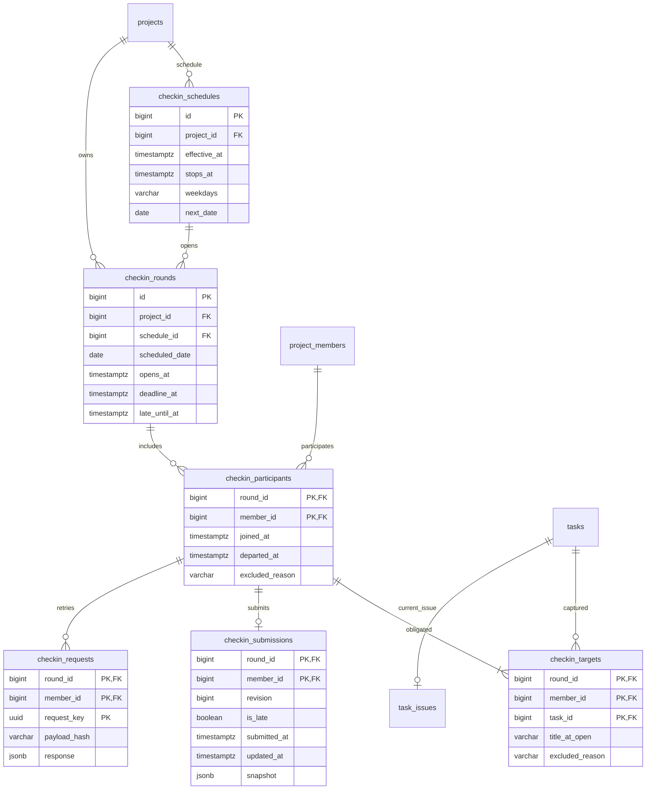

# 체크인 회차와 대상 보존

## 적용 정책

- Asia/Seoul 지정 요일 00:00 시작, 다음 날 00:00 정시 마감, 다음 지정 요일 00:00 지각 종료. 끝 경계는 미포함이다.
- 회차 시각은 생성 후 변경하지 않는다. 일정 변경은 기존 마지막 회차의 지각 종료 이후부터 적용한다.
- 회차 시작 당시 승인된 팀원의 미완료·미취소 담당 작업을 보존한다. 도중 완료는 유지하며 신규 배정·가입은 다음 회차부터 포함한다.
- 명시적 담당 해제와 취소는 진행 중 회차 대상에서 제외한다. 제출 기록은 삭제하지 않는다.
- 내보내기는 의무를 유지하고 제출을 차단한다. 배정 정리와 구분하며, 같은 멤버 ID로 재가입해도 과거 회차 제출 권한을 복원하지 않는다.
- 종료 시 제출 기한이 남은 미제출 의무를 제외한다. 이미 제출했거나 확정된 누락은 보존한다.

## 실행과 트랜잭션

ProjectService, TaskAssignmentService, TeamService, TaskService, TaskRelationService에 승인된 호출을 추가했다. 권한 확인 후 데이터를 바꾸기 전에 도래한 회차를 생성한다. 작업 이름 수정도 먼저 회차를 생성해 시작 당시 이름을 보존한다. 회차·대상 처리와 A의 변경은 같은 프로젝트 잠금·트랜잭션을 사용한다.

자동 작업은 기본 60초마다 진행 중 프로젝트를 100개씩 조회하고 프로젝트별 트랜잭션으로 회차를 생성한다. 실패한 프로젝트는 로그에 남고 다음 실행 때 재시도한다. 여러 인스턴스가 실행해도 같은 프로젝트 행 잠금과 회차 고유 제약을 사용한다. 조회·제출 때도 도래한 회차를 생성하므로 스캔 지연 중에도 같은 규칙을 적용한다.

설정:

- `app.checkin.scheduler-enabled`: 기본 true, 로컬 통합 테스트에서는 false.
- `app.checkin.scan-delay-ms`: 기본 60000.

## 마이그레이션과 시작 시점

V3는 현재 작업 이슈, V4는 새 체크인 구조다. 기존 V1/V2와 단수형 legacy 체크인 테이블은 유지한다. 기존 legacy 기록을 새 대상 기록으로 추정해 복사하지 않는다.

V4 적용 시점과 프로젝트 생성 시각 중 늦은 시점을 최초 일정 기준으로 사용한다. 그 이후 첫 지정 요일 00:00부터 회차를 생성한다. 배포 전 과거 의무·누락은 만들지 않는다. 배포 전에 팀원의 새 마이그레이션 번호와 중복 여부를 다시 확인한다.

B 저장에는 PostgreSQL SQL/JdbcTemplate을 사용한다. A의 JPA 데이터는 SQL 조회 전에 flush하며 같은 데이터소스·JpaTransactionManager에 참여한다. A 엔티티에 체크인 필드를 추가하지 않는다.

## 실제 PostgreSQL ERD

추가로 단일 행 `checkin_rollout`에 적용 시점을 저장한다. 이 문서와 V3/V4가 현재 실행용 기준이며 이전 MySQL 초안의 완료자·수동 진행률 구조를 사용하지 않는다. 실제 수행자 기록·개인 기여도·리스크 가중치는 이번 범위에 포함하지 않는다.
